```mermaid
graph TD
    subgraph POWER["⚡ Power"]
        PB[USB Power Bank]
    end

    subgraph MCU["🧠 XIAO ESP32-S3"]
        USBC[USB-C Power In]
        GPIO2[GPIO2 - 1-Wire Data]
        GPIO3[GPIO3 - VEML INT]
        SDA[GPIO5 - SDA]
        SCL[GPIO6 - SCL]
        GND_MCU[GND]
        VCC_MCU[3.3V Out]
    end

    subgraph VEML["💡 VEML6030 Light Sensor"]
        VEML_VCC[VCC]
        VEML_GND[GND]
        VEML_SDA[SDA]
        VEML_SCL[SCL]
        VEML_INT[INT]
    end

    subgraph ADS["📊 ADS1115 ADC"]
        ADS_VCC[VCC]
        ADS_GND[GND]
        ADS_SDA[SDA]
        ADS_SCL[SCL]
        ADS_ADDR[ADDR]
        ADS_A0[A0]
        ADS_A1[A1 - unused]
        ADS_A2[A2 - unused]
        ADS_A3[A3 - unused]
    end

    subgraph TEMP["🌡️ DS18B20 Probes"]
        PROBE_VCC[VCC - Red x2]
        PROBE_DATA[DATA - Yellow x2]
        PROBE_GND[GND - Black x2]
        R1[4.7kΩ Pullup]
    end

    subgraph CT["⚡ SCT-013-030 CT Clamp"]
        CT_OUT1[Output Lead 1]
        CT_OUT2[Output Lead 2]
    end

    subgraph PASSIVE["🔧 Passives on Breadboard"]
        BURDEN[33Ω Burden Resistor]
        C1[10µF Cap - CT filter]
        BIAS1[10kΩ Bias R1]
        BIAS2[10kΩ Bias R2]
    end

    %% Power rails
    PB -->|USB-C cable| USBC
    VCC_MCU -->|3.3V rail| VEML_VCC
    VCC_MCU -->|3.3V rail| ADS_VCC
    VCC_MCU -->|3.3V rail| PROBE_VCC
    GND_MCU -->|GND rail| VEML_GND
    GND_MCU -->|GND rail| ADS_GND
    GND_MCU -->|GND rail| PROBE_GND

    %% I2C bus - shared
    SDA -->|I2C SDA| VEML_SDA
    SDA -->|I2C SDA| ADS_SDA
    SCL -->|I2C SCL| VEML_SCL
    SCL -->|I2C SCL| ADS_SCL

    %% VEML interrupt
    VEML_INT -->|INT signal| GPIO3

    %% ADS1115 address pin
    ADS_ADDR -->|tie to GND = 0x48| GND_MCU

    %% DS18B20 1-Wire bus
    GPIO2 -->|1-Wire bus| PROBE_DATA
    PROBE_DATA --- R1
    R1 -->|pullup to 3.3V| VCC_MCU

    %% CT Clamp to ADS1115 A0
    CT_OUT1 --> BURDEN
    CT_OUT2 --> BURDEN
    BURDEN --> ADS_A0
    CT_OUT1 --- C1
    C1 --- GND_MCU

    %% Bias divider for CT midpoint
    VCC_MCU --> BIAS1
    BIAS1 --> ADS_A0
    BIAS2 --> GND_MCU

    %% Styling
    classDef power fill:#c8e6c9,stroke:#2e7d32,color:#000
    classDef mcu fill:#bbdefb,stroke:#1565c0,color:#000
    classDef sensor fill:#fff9c4,stroke:#f57f17,color:#000
    classDef passive fill:#f3e5f5,stroke:#6a1b9a,color:#000

    class PB power
    class USBC,GPIO2,GPIO3,SDA,SCL,GND_MCU,VCC_MCU mcu
    class VEML_VCC,VEML_GND,VEML_SDA,VEML_SCL,VEML_INT,ADS_VCC,ADS_GND,ADS_SDA,ADS_SCL,ADS_ADDR,ADS_A0,PROBE_VCC,PROBE_DATA,PROBE_GND,CT_OUT1,CT_OUT2 sensor
    class R1,BURDEN,C1,BIAS1,BIAS2 passive
```

## Breadboard Wiring Reference

**Power rail setup first**

- USB power bank to XIAO USB-C
- XIAO 3.3V pin to breadboard positive rail
- XIAO GND pin to breadboard negative rail

**I2C bus (shared by VEML6030 and ADS1115)**

- XIAO GPIO5 (SDA) to a shared row, then jump to VEML6030 SDA and ADS1115 SDA
- XIAO GPIO6 (SCL) same approach to both SCL pins
- Both devices pull from the same 3.3V and GND rails

**ADS1115 address**

- ADDR pin tied directly to GND rail = I2C address 0x48
- No conflict with VEML6030 at 0x10

**DS18B20 probes (both on same bus)**

- Red leads to 3.3V rail
- Black leads to GND rail
- Yellow leads to shared row, then to XIAO GPIO2
- 4.7k resistor from that shared data row up to 3.3V rail

**CT clamp to ADS1115 A0**

- Both CT output leads across the 33 ohm burden resistor on the breadboard
- 10uF cap across those same two points to GND for filtering
- Two 10k resistors in series from 3.3V to GND, midpoint connects to A0 as bias voltage

**VEML6030 INT pin**

- Single wire from INT to XIAO GPIO3