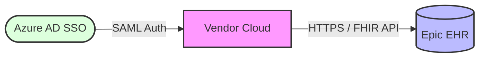

<%*
let parentFolder = tp.file.folder(true).split('/').pop();
let today = tp.date.now("YYYY-MM-DD");
await tp.file.rename(parentFolder + "_" + today);
-%>
---
type: vendor-evaluation
vendor: "<% tp.file.title %>"
status: In Progress
created: <% tp.file.creation_date("YYYY-MM-DD") %>
last_reviewed: <% tp.file.last_modified_date("YYYY-MM-DD") %>
tags:
  - vendor-eval
  - enterprise-architecture
---

# Vendor Evaluation: <% tp.file.title %>

## 📋 Executive Summary
* **Business Objective:** Brief description of the problem this vendor solves.
* **Architecture Alignment:** High-level statement on fit with existing infrastructure and application ecosystem.
* **Recommendation Matrix:** | Evaluation Pillar | Score (1-5) | Key Risk / Highlight |
| :--- | :---: | :--- |
| Fit with Architecture | | |
| Standards Compliance | | |
| Integration Complexity | | |
| Security Posture | | |
| Scalability | | |
| TCO Alignment | | |

---

## 🔒 Security Posture & Standards Compliance
> [!IMPORTANT]
> Infosec approval is required prior to sandbox provisioning or technical proof of concept.

### Regulatory Compliance
* **HIPAA / HITECH:** BAA execution required? (Yes/No)
* **SOC 2 Type II:** Date of latest report: 
* **HITRUST Certification:** (Current / In Progress / None)
* **Other Standards:** (FDA, CE Mark, ISO 27001 if applicable)

### Data Architecture & Privacy
* **Data Classification:** (PHI / PII / Financial / Internal)
* **Data at Rest Encryption:** (AES-256 standard)
* **Data in Transit Encryption:** (TLS 1.2 / 1.3 required)
* **Identity & Access Management:** SSO Support (SAML 2.0 / OIDC), MFA Enforcement, and RBAC capabilities.

---

## 🔌 Integration Complexity & Existing Architecture Fit
### Interfaces & Interoperability
* **EHR Integration:** (Epic Integration / App Market / Interconnect / FHIR APIs)
* **Standards Supported:** (HL7 v2, FHIR R4, DICOM, X12)
* **Integration Method:** (Real-time Web Services / Batch SFTP / Message Queue)

### System Context Diagram (Mermaid)

### Technical Dependencies
- **Hosting Model:** (SaaS / Private Cloud / On-Premise VM)
- **Client Requirements:** (Web browser / Citrix / Mobile App / Native OS)
- **Network Requirements:** (Inbound/Outbound IP Whitelisting, VPN Tunnel, Reverse Proxy)
    

## 📈 Scalability & Vendor Viability
- **High Availability / DR:** SLA uptime percentage and RTO/RPO metrics.
- **Performance Under Load:** Concurrent user handling and historical API response latency.
- **Vendor Viability:** Years in business, financial backing, and reference healthcare clients.
    

## 💰 Total Cost of Ownership (TCO)

> [!NOTE]
> 
> Projections should look at a 3-to-5 year window to account for scaling costs and implementation fatigue.

### Financial Breakdown

- **Implementation Fee (Year 1 One-time):** $0.00
- **Annual Subscription / Licensing:** $0.00
- **Internal Resource Requirements:** (FTE hours for Implementation Management and Biomedical/IT engineering)
- **Interface / Custom Development Fees:** $0.00
    

### 5-Year Projection

|**Cost Category**|**Year 1**|**Year 2**|**Year 3**|**Year 4**|**Year 5**|
|---|---|---|---|---|---|
|**Licensing/SaaS**||||||
|**Professional Services**||||||
|**Infrastructure / Compute**||||||
|**Annual TCO**|**$0.00**|**$0.00**|**$0.00**|**$0.00**|**$0.00**|

## 📝 Next Steps & Action Items

- [ ] Schedule technical deep dive with the vendor integration engineer.
- [ ] Submit SOC 2 Type II and architecture overview to Infosec for review.
- [ ] Confirm Epic App Market or Interconnect requirements with EHR team.